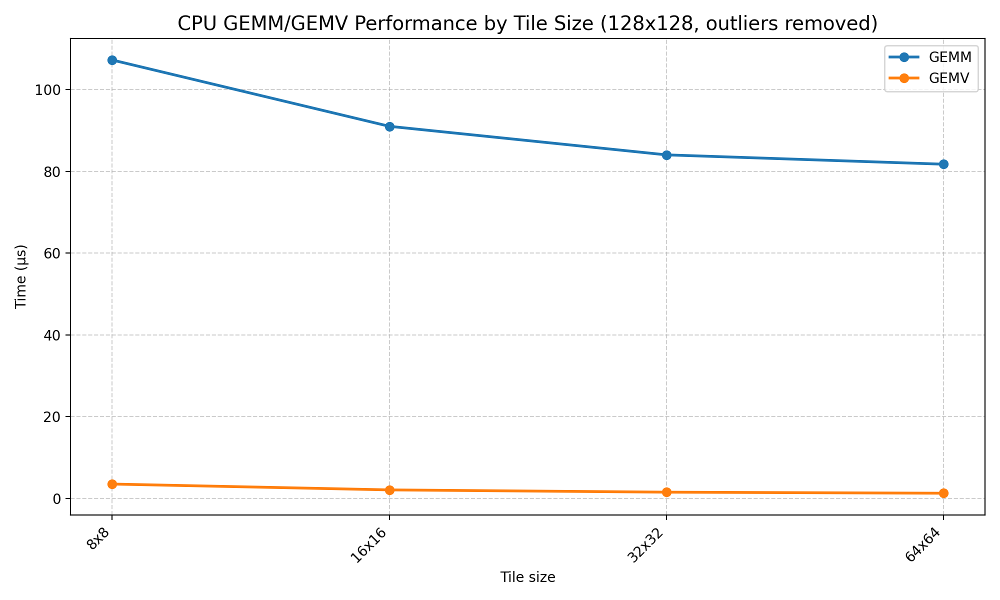
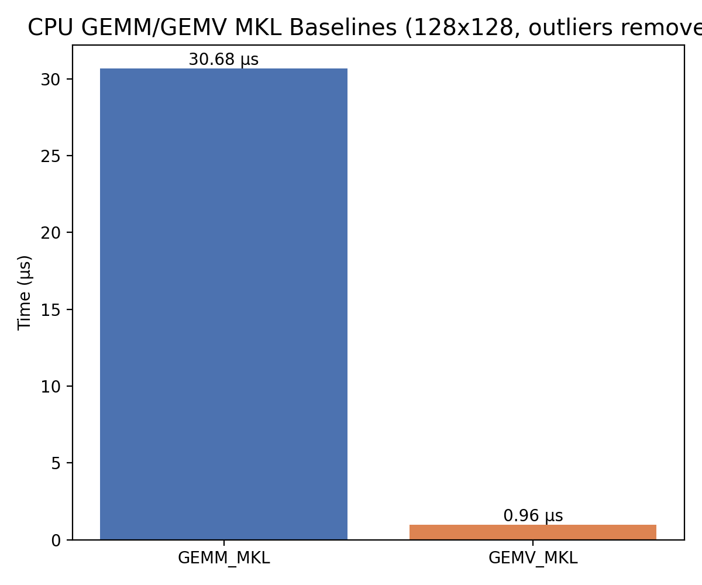
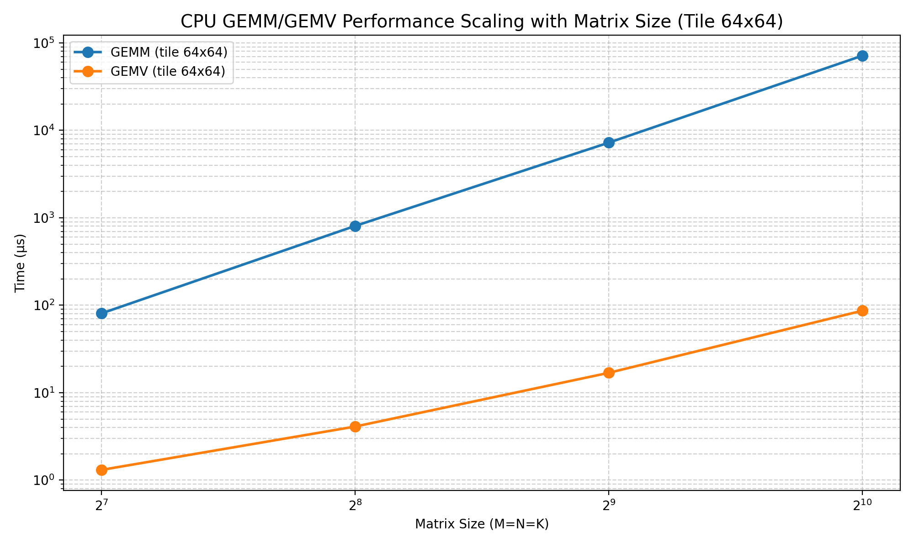
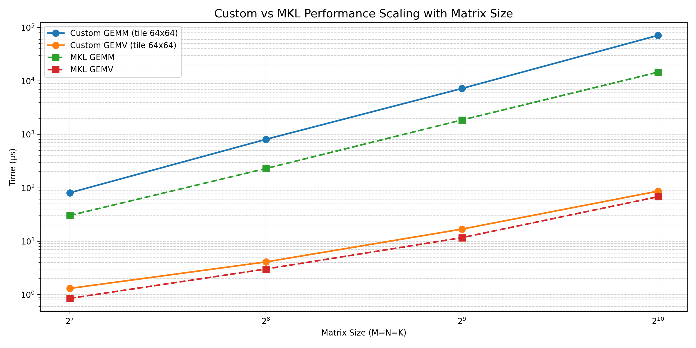
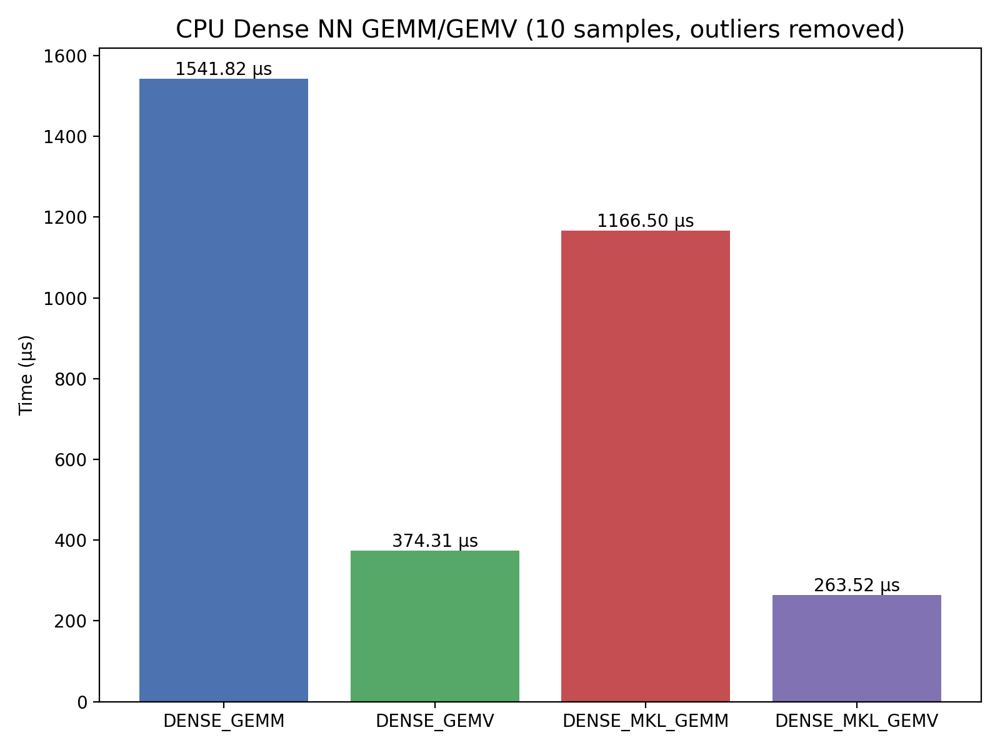
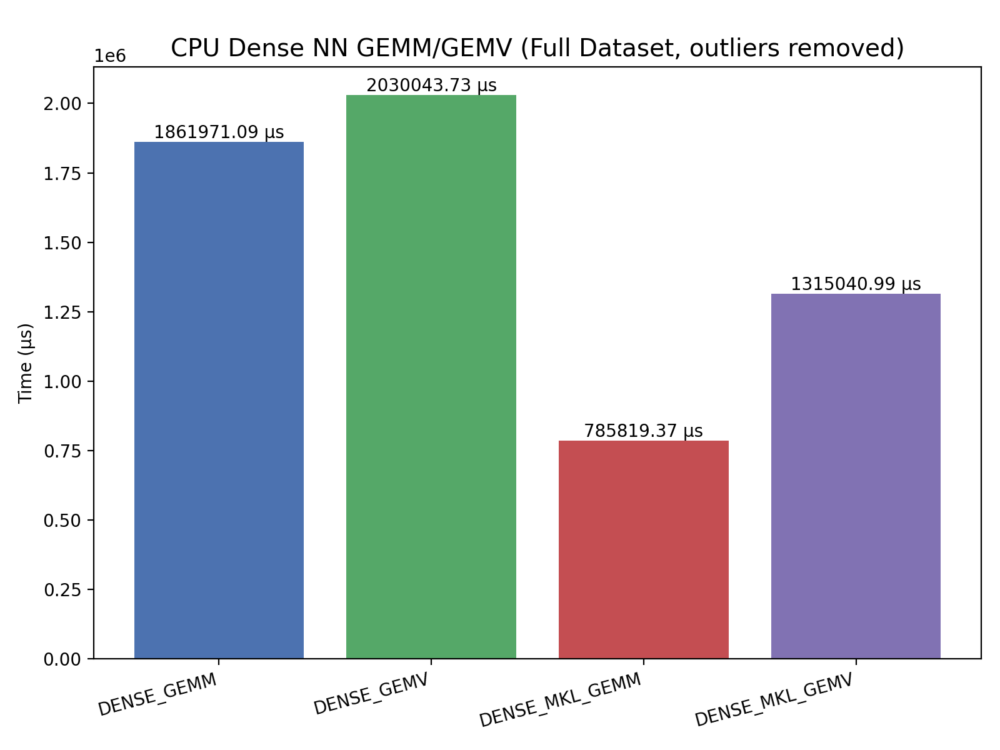
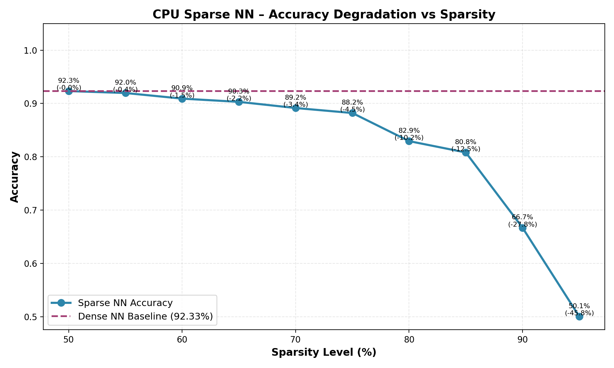
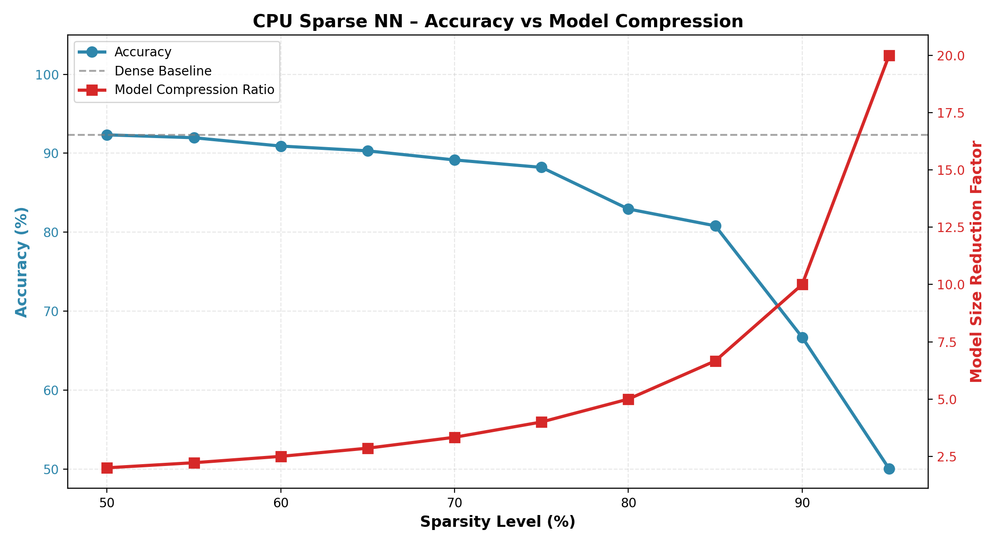
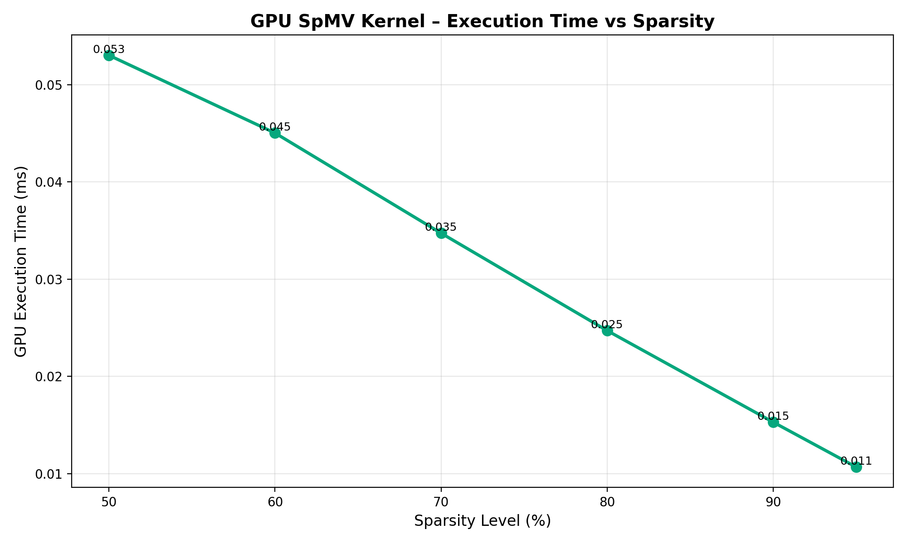
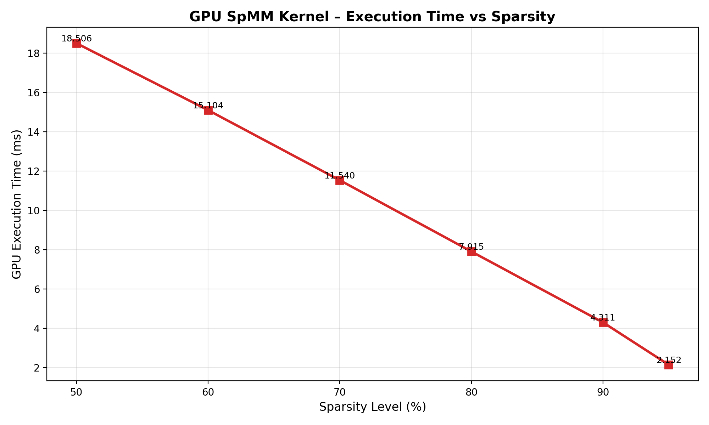

[](https://classroom.github.com/a/TtqHArU_)
# 🎓 Project


By the end of the project, you will be able to:
* Optimize and design neural networks.
* Optimize and design sparse neural networks.
* Implement and optimize matrix multiplication.


**Note:** You must review Tutorial 01 before starting this lab. You will need to 
finish tutorial 02 for the GPU part.
***

## 🛠️ Logging in to the ECE Cluster
The ECE computer server is a local server used for this course. The ECE server
has 6 nodes, each with a 20-core Intel CPU and an Ada2000 GPU. The ECE server 
uses a SLURM scheduler. SLURM (Simple Linux Utility for Resource Management)
is an open-source workload manager that allocates exclusive resources (computer nodes)
to users for a specific duration to run their tasks. It manages a queue of jobs, 
ensuring that resources are used efficiently and jobs are run fairly. You will 
need a username to log in to the server.  Your username is the one that you use 
to login to PCs in labs. With that, you will need to SSH to the server using the
following command:

 ```
 ssh <username>@srv-cad.ece.mcmaster.ca
 ```

***

## ➕ Cloning the Repository

This step explains how to clone the repository. You will use **`git`**, a version 
control system, to clone the repository and push your code to it. To clone 
the repository, you will need to use the following command:


```
git clone https://github.com/4sp4-2025/<repo name>.git
```

Where `repo name` is your repository. The repository is private, so you may get an 
error when you enter your username and password. To solve this, you will need to 
 zuse a **Personal Access Token (PAT)** instead of your password.


***

## 🚀 Building and running the starter code

This section explains how you can build and run the code on the 
ECE cluster. First, go to where the project is cloned:

```
cd <where/the/repo/is/cloned>
```
All necessary instructions to build and run the code are 
provided in the `build_run.sh` file.
You can open the file using a text editor like `nano` or `vim`, 
e.g., `vim build_run.sh`.  Use the following command to build 
and run the code:

```
sbatch build_run.sh
```

This command submits the `build_run.sh` script to the SLURM scheduler. 
The instructions in the `build_run.sh` file are
unix commands that will be executed on a compute node. The output of 
the job will be saved in a `*.out`file.

* **Never use `bash`** to run your code on the login node. 
  Use `sbatch` instead. `bash` runs the code directly on
  the login node, while `sbatch` submits the job to the SLURM 
  scheduler, which runs it on an available compute node.
* You should **never** run code on the login node unless it 
  takes less than 30 seconds.
* You can check the status of your job using `squeue -u <username>`.


***


## ✅ Tasks
Deep neural networks (DNN) consist of multiple layers that perform matrix multiplications 
followed by nonlinear operations.
In each layer, the input is multiplied by a weight matrix and then passed through a 
nonlinear activation function (for example, softmax).
The output of a layer becomes the input to the next layer.
Matrix multiplication is the most computationally expensive operation in neural networks.
Your main task is to implement a three-layer neural network.
Implement both dense and sparse variants of the network and compare their accuracy 
and performance against state-of-the-art implementations.


### DNN Description:
A DNN with two linear layers and two non-linear activation functions. 

#### Mathematical Representation:

Let's denote:

`X:` Input vector (n-dimensional)

`W1:` Weights matrix for the first layer (h x n)

`b1:` Biases vector for the first layer (h-dimensional)

`W2:` Weights matrix for the second layer (m x h)

`b2:` Biases vector for the second layer (m-dimensional)

`H:` Hidden layer activations (h-dimensional)

`Z:` Output vector before softmax (m-dimensional)

`Y:` Output vector (m-dimensional)

The forward pass of a DNN with two layers and softmax can be represented as follows:

`H = tanh(X * W1^T + b1)`

`Z = sigmoid(H * W2^T + b2)`

`Y = argmax(Z)`

Where:


tanh is an activation function, defined as:
`softmax(Z) = (exp(Z) - exp(-Z)) / (exp(Z) + exp(-Z))`.
sigmoid is another commonly used activation function in neural networks, defined as `1/(1 + exp(-z))`. argmax returns the index of the maximum element in the vector.

Explanation:

*Input Layer:* The input data is fed into the input layer.

*Hidden Layer:* The input is multiplied by the weights of the first layer, and the biases are added. The result is passed through the tanh activation function.

*Output Layer:* The activations from the hidden layer are multiplied by the weights of the second layer, and the biases are added. The result is passed through the sigmoid activation function to normalize the outputs into a probability distribution.

*Prediction:* Eventually argmax is used to predict the class label based on the output vector Z.


We have already trained the weight matrices and biases for this network on the MNIST dataset.
The weights and biases are included in the `data` folder; they are downloaded from the 
server when you run the provided `build_run.sh` script. See that script for details.
All model parameters are stored as CSV files in the `data/model/` folder.
The MNIST dataset is also provided in the `data` folder as a CSV file.
Functions for reading these CSV files are provided.
The MNIST CSV contains features and labels; labels are located in the first column after loading.

**Note:** The code assumes the data is in the `data` folder. If you set up the project in a 
different location than the server, update the paths accordingly.


### Task 1: Dense Neural Network

- Write a `Python` script (`script/dense_nn.py`) that implements the dense neural network described above. Measure and report the network 
accuracy on the `MNIST` dataset.
- Re-implement the same network in `C++` using your optimized matrix-matrix (`MM`) and matrix-vector (`MV`) operations. 
Measure execution time of the key calls in the dense NN (for example, `MM`, `MV`, and activation functions).
  test only the first 10 features of the `MNIST` dataset.
- Before the end-to-end C++ implementation, develop and optimize the `MM` and `MV` kernels. For `MV` benchmarking.
- Document the optimization strategies applied to each operation and provide an analysis of the resulting performance improvements.


### Task 2: Sparse Neural Network
- Implement a pruning algorithm to sparsify the weight matrices (in `script/sparsify_weight.py`). Magnitude\-based pruning 
(removing weights with the smallest absolute values) is acceptable.

- Write a `Python` script to prune `W1` and `W2` for sparsity levels from 50\% to 95\% in steps of 5\%. 
For each sparsity level, save the pruned weight matrices in dense CSV format using the naming convention: 
`<sparsity_level>_W1.csv` and `<sparsity_level>_W2.csv` (for example, `80_W1.csv` and `80_W2.csv`). 
When loading these files in `C++`, convert the dense matrices to a sparse format (e.g., CSR).

- Implement efficient sparse matrix\-matrix (SpMM) and sparse matrix\-vector (SpMV) kernels. Document the optimization 
strategies for each kernel and provide an analysis of the measured performance improvements.

- After validating SpMV and SpMM, implement the sparse neural network using these operations. Report accuracy and 
runtime for each sparsity level and compare the results with the dense neural network.

### Task 3: GPU Implementation 
Implement both dense and sparse neural networks on the GPU. Use CSR format for sparse matrices on the GPU.
First, implement optimized matrix-matrix (MM) and matrix-vector (MV) kernels on the GPU. Apply common GPU 
optimizations such as memory coalescing, tiling/shared memory, warp-level primitives, proper thread/block configuration, 
asynchronous copies, and tensor cores where applicable.
Then build the dense and sparse neural networks using these kernels and compare their performance on the GPU.

**Important Note** To enable GPU in the project, you will need to use `-DGPU_ENABLED=ON` when calling CMake. 

### Bonus Task: New Pruning Method and Outperforming vendor libraries
* Implement a new pruning method that outperforms magnitude-based pruning in terms of performance while maintaining 
similar accuracy. You may use any method.
* Compare the performance of your dense and sparse neural networks with vendor libraries such as Intel MKL (CPU) and 
cuBLAS/cuSPARSE (GPU). If you outperform these libraries, you will receive bonus points: target 1.2× faster than MKL 
(sparse NN vs dense MKL) and 1.1× faster than cuBLAS (sparse NN vs dense cuBLAS).

### The expected output
Your submission must include the following:

* Implementing dense NN using MM and MV operations (CPU and GPU).
* Implementing sparse NN using SpMM and SpMV operations for different sparsity levels from 50% to 95% with 
a step size of 5% (CPU and GPU).
* Bonus: build a new pruning method that outperforms magnitude-based pruning in terms of performance and provides a similar accuracy.
* Outperforming cuBLAS/cuSPARSE and Intel MKL for dense and sparse NN implementations (bonus).
* Provide stacked bar plots for different optimizations applied to MM/MV and SpMM/SPMV operations. 
  The x-axis should represent different matrix sizes (for MM) and different sparsity levels (for SpMM). 
  The y-axis should represent the execution time. Each bar should be divided into different colors representing 
  different optimizations applied (e.g., naive, cache blocking, vectorization, parallelization, etc.). 
  Provide separate plots for MM/MV and SpMM/SpMV.
* Repeat all above plots for GPU code as well.
* The necessary Python scripts (and packages) to generate all plots. You won't be allowed to push plots to the repo. 
  We should be able to generate all plots using your scripts and the logs generated from running your 
  code on the ECE server.
* four benchmarks are provided in the main directory:
  * `main_bench.cpp`: contains benchmarks for MM/MV/SpMM/SpMV on CPUs using Google Benchmark.
  * `main_bench.cu` : contains benchmarks for MM/MV/SpMM/SpMV on GPUs using NVBench.
  * `nn_cpu_bench.cpp`: contains benchmarks for dense and sparse neural networks on CPUs using Google Benchmark.
  * `nn_gpu_bench.cu`: contains benchmarks for dense and sparse neural networks on GPU.
  
   
### Evaluation
Your lab submission will be graded based on these criteria:

* Your code compiles and runs successfully on the ECE cluster using the provided `build_run.sh` script (Pass/Fail).
* All grading tests are passed as expected.
* The quality of your plots and its analysis, which must:
  * Convey a correct and clear argument.
  * Be visually understandable with proper labels, units, and a concise 1-2 sentence executive summary.
* All plots/model parameters must be generated using your provided Python scripts and the logs from your code runs on the ECE server. 
Plots pushed directly to the repository will not be accepted. 
  

### Submission
Follow these guidelines for a successful submission:
* First, please implement all TODOs in the code and remove all comments that
  start with `TODO`.
* Push all your code to the main branch of your repository before the deadline.
* Ensure your code compiles and runs on the ECE cluster. Submissions that fail to 
 compile or run will receive a grade of zero. The TA will only use the `build_run.sh` file for 
 building and running your code. You may want to make a copy of the script for your final testing.
* The build_run.sh script's execution should only output results from Google Test and 
 Google Benchmark. Do not include any extra output from cout or printf. This can negatively 
 impact your grade, and regrade requests for this reason will not be accepted.
* All logs should be redirected to `logs/` directory, all model parameters should be saved in 
`data/model`, and all plots should be saved in the `plots/` directory. These directories are not 
tracked by git to avoid pushing log files or plots to the repository. 

  
## Descriptive Answers (TODO)
Typically, there is no single correct answer/plot for the following questions. Rely on your thought process!

### Plot(s) 1: CPU MM/MV and SpMV/SpMM performance analysis

**Tile Size Scaling:**


As you can see in this plot while testing 128x128 matrices, benchmarking the CPU GEMV and GEMM across multiple tile sizes show that a tile size of 64. Both implementations use OpenMP for parallelism and vectorization to recieve a better runtime than the sequential implementation for it's respective function. This benchmark shows that GEMM experiences a declining curve as we approach a tile size of 64x64. However for gemv, tiling marginally decreases the runtime. Tiling using 64x64 is beneficial as it can land neatly in L1 or L2 cache. This shows that we see a pretty decent upgrade when using OpenMP + Vectorization + Tiling for GEMM operations. The reason for GEMM being significantly slower than GEMV is that, due to the matricies/vectors being as small as 128 width or length, it is costly to run GEMM in comparison to GEMV. However, if we increase the matrix or vector sizes, the GEMM implementation will be faster than the GEMV implementation which you will see later with the dense_nn implementation's runtimes. Overall in an 128x128 situation, GEMV dominates in small matrix/vector scenarios due having little overhead in comparison to GEMM's packing, blocking, scheduling, cache and other overheads it has.

**MKL Baseline Comparison:**


Looking at the plot above for 128x128 matricies, we can see how the MKL GEMM/GEMV functions behaved. The GEMM application is slower for a matricies as small as 128x128 than GEMV. The implemntations in Figure 1a were not able to top these numbers, however, these numbers follow the same principles as Figure 1a. GEMV will be faster than GEMM when doing small matrices/vectors like sizings of 128x128.

**Matrix Size Scaling (Log-Log):**


Figure 1c shows the runtime changes as we change the matrix sizes while using a tile size of 64. An analysis is provided in comparison to the mkl implementation under figure 1d.

**Custom vs MKL Scaling Comparison:**


Description: TODO: please provide details what each value in above plots means and how you draw a conclusion from it. Consider:
- How tile size affects cache efficiency and execution time
- The performance gap between custom and MKL implementations
- Scaling behavior (O(n²) vs O(n³)) on log-log plot
- Memory bandwidth vs compute-bound regimes

Figure 1d compares the runtimes of the custom and MKL implementations of GEMM and GEMV across different matrix sizes. As we saw in Figure 1a, the tile size that provided the best results were 64x64, as it improves the cache reuses the best, but it was not enough to top the MKL implementations. MKL implementations use multi-level blocking along with optimized packing strategies making it difficult to top. GEMV grows slowly dues to the operation being O(n²) and memory-bandwidth-bound which explains how close both custom and the mkl implementations are in the plot. GEMM on the other hand has a O(n³) computational complexity and the MKL implementation has more efficient microkernels which creates the gap between both GEMM implementations has the matrices get larger. For small sizes, tiled GEMM have high overhead making it slower relative to GEMV. The seperations between the GEMM/GEMV lines demonstrate the difference between bandwidth-limited and compute-limited regimes. 

### Plot(s) 2: Sparse / Dense NN Accuracy/Performance Analysis

**Dense NN Performance (Small Batch):**


As you can see the plot above, due to the number of samples being 10, having smaller data pool mean the GEMV functions will perform better than its respective GEMM implementation. The custom GEMV is faster than the custom GEMM function while the MKL GEMV is faster than the MKL GEMM. The dense_nn follows the same principles as showcased in Figures 1a to 1d. Since we are working with a smaller data pool, GEMV_dense_nn functions would be faster. The MKL GEMM dense_nn function is about 400µs faster than the custom GEMM dense_nn function, while the MKL GEMV is about 100 µs faster than the custom GEMV dense_nn function. The MKL GEMM dense_nn implementation is about 1.3x times faster than the custom version and the MKL GEMV dense_nn implementation is about 1.4x faster than it's custom version. This is expected due to the optimized nature of MKL related functions like GEMV and GEMM which were used in two out of the four full implementations. Even though each of the four used either MKL GEMM, MKL GEMV, GEMM or GEMV functions, many high performance principles like vectorization, tiling, and OpenMP were used to optimize the performance of each of the functions. Even more simple concepts like seperation of compute-bound vs memory-bound operations, memory pre-allocations, hoisting, loop fusion and many more techniques were used.

**Dense NN Performance (Full Dataset):**


Building upon, Figure 2a, Figure 2b, shows the results of running a full dataset through the 4 different dense_NN functions. Like mentioned under Figure 2a, while staying consistent and using mulitple high performance principles, we varied between using MKL_GEMM, MKL_GEMV, GEMV and GEMM across each of the four dense_NN implementations. In figure 2a we ran against 10 labels, but in Figure 2b we ran against 60000 labels and as you can see the GEMM implementations are faster than its respective comparison point(GEMM faster than GEMV, MKL GEMM faster than MKL GEMV). This is because GEMM is optimized for large matrix-matrix mulitplication in comparison to GEMV. GEMV operates a row at a time, so it heavily underutlizes CPU vectorization. This is on top of the fact that each call has overhead, and memory access is not as efficient as it is in GEMM. We really face function call overhead and memory bandwidth bottleneck here. For large batches, GEMM is compute-bound while GEMV is memory-bound and its really shown here. GEMV does fewer FLOPS per call, and with poor cache reuse, and its memory-bound nature, it ends being slower than GEMM for large batches. The MKL functions follow the same principle.

**Sparse vs Dense Accuracy Degradation:**


Figure 2c highlights that increasing sparsity reduces accuracy. This is nature is essentially due to having more weights set to zero, thus removing he connections between neurons. It loses its degrees of freedom which causes the reducution in ability to model complex patterns in the data. This results in the network to be less capable of identifying little differences between classes. Moderate Sparsity can be a form of regularization, however high levels of sparsity restricts learning capacity. Therefore this plot proves the relative theory of increasing the sparsity levels would generally decrease the networks accuracy as it can no longer capture the data's full structure.

**Sparse NN: Accuracy vs Model Compression:**


Figure 2d illustrates that the model's accuracy stays relatively stable from sparsity levels of 50% to 75% and it starts to decline more noticably at 80%. As sparsity increases, the compression ratio rises steadily. As per the graph, a sweet spot would be around 70-80% sparsity where accuracy would be above 80% and has a 4-6x model compression. This is a strong tradeoff. The accuracy drops to 67% once we reach the sparsity levels of 90% and collapses to 50% accuracy at 95% sparsity levels. When tested on small versus full batch datasets, the accuracy trend remains consistent, but due to accumulated weak activations, the higher sparsity levels will magnify errors more on larger data sets. 80% sparsity offeres the best ballance where the model is fast and really compressed which keeping an acceptable accuracy. 85% enters the danger zone, because after 85%+, the drop off accelerates.

Description: TODO: follow like above example. Consider:
- How model accuracy degrades with increasing sparsity levels
- The sweet spot between compression ratio and accuracy loss
- Performance scaling from small to full dataset batches
- Which sparsity level provides best speedup-accuracy tradeoff

### Plot(s) 3: GPU Performance Analysis

**GPU SpMV Sparse Kernel Performance:**


Figure 3a highlights that the runtime is faster as the sparsity levels increase. The runtime has a steep linear decline as the sparsity levels rise. At 95% sparsity, the runtimes is 5x faster than the 50% sparsity. Due to the sparse matrix storage formats on the GPU, it can efficiently skip over the zero elements which confirms the rapid decrease. The fastest runtime was at 95% sparsity levels.

**GPU SpMM Sparse Kernel Performance:**


Figure 3b shows the overall same trend however its slower than the GPU SpMV functions. This difference is due to SpMM's computationally intensive nature, causing the runtime to be slower than SpMV. The runtime drops sharply at 50% sparsity to 95% sparsity(about 18ms to 2ms). This shows more of speedup than SpMV. There is a clear linear decline in both graphs.

**GPU Sparse NN: Execution Time + Accuracy Tradeoff:**


Description: TODO: follow like above example. Consider:
- How GPU kernel execution time changes with sparsity levels
- The dual-axis relationship between execution time and model accuracy
- GPU vs CPU performance comparison for sparse operations
- Which sparsity level achieves best GPU speedup-accuracy tradeoff

So the data shows that for both SpMV and SpMM an inverse relationship between sparsity level and GPU runtime. The reason for this trend is due to efficient use of sparse matrix storage formates on the GPU. Fewer non-zero elements results in less floating-point operations and memory fetches which are primary bottlenecks in GPU computing. 

The goal is to find a balance where the runtime savings are maximized while keeping accuracy within an acceptable tolerance. Excessive pruning causes the model's accuracy to decrease while runtimes speed up.

Based on the run data logs, 70% sparsity achieves the best GPU speedup-accuracy tradeoff. It keeps a high accuracy while having a worthwhile speedup.


Dislosure:

We spoke to the professor about the situation here is the disclosure.
Sriram:

-Completed the python Dense_nn function
-Completed the GEMV and GEMM function
-Completed, the dense_nn function C++ for custom and MKL libraries
-Completed the dense_nn function CUDA
-Completed the benchmarks for Dense_nn functions and GEMM and GEMV
-Created plot code for the Dense_nn functions and GEMM and GEMV
-Did the plot descriptions for all the Figures above


Karthik:
-Completed the python Sparse_nn function
-Completed the SpMV and SpMM functions (AVX)
-Completed the sparse_nn function in C++ 
-Completed the sparse_nn function in CUDA
-Completed the benchmarks/testbenches for Sparse_nn functions and SpMV and SpMM
-Assisted in plot code for the Sparse_nn functions and SpMV and SpMM
